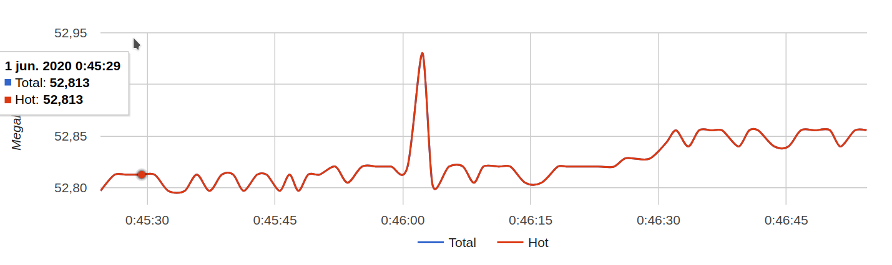

# .NET Core Architecture Test

## Introduction
This is an architecture test for **.NET Core** ecosystem.    
The author has not any experience on **.NET Core** application development so it possibly will add quite objectivity.    
It pretends to test next aspect list in order to compare whit other options.    

- [Linux integration](#linux-integration)
- [Virtual environment integration (sdk level)](#virtual-environment-integration-sdk-level)
- [IDE integration](#ide-integration)
- [Isolation](#isolation-in-terms-of-the-twelve-factors-app) (in terms of [**The Twelve Factors App**](https://12factor.net/))
- [Resilience](#resilience)
- [Hot-reload / AOT](#hot-reload-aot)
- [Efficiency (time to deploy, time to response, stress)](#efficiency-time-to-deploy-time-to-response-stress)
- [Compatibility with other technologies](#compatibility-with-other-technologies)
- [Maintainability / reusability](#maintainability--reusability)
- [Monitoring (resource consumption, health, readiness)](#monitoring-resource-consumption-health-readiness)
- [Traceability](#traceability)
- [Logging](#logging)
- [Troubleshooting](#troubleshooting)

### Setup
We are going to work on Linux OS.    
Before you get started a few things needs to be set up.  

dotnet new webapi -o ArqNetCore
dotnet add package MySql.Data.EntityFrameworkCore

### IDE
It can be used [**Visual Studio Code**](https://code.visualstudio.com/). It has a `c#` extension that allows execute and debug our application. Syntax highlighting and code completion as well as ‘go to declaration’ feature.    

### DB
It is convenient to use docker because we can switch from one project to other and shut down all we dont need easily.    
``` sh
docker run --name arq-mysql -e MYSQL_ROOT_PASSWORD=some-pass -p 3306:3306 -d mysql
# The following command may need to be run multiple times until the server is fully available
docker exec -it arq-mysql mysql -u root -p #enter some-pass
```

Once on mysql client
``` sql
CREATE DATABASE dbnetcore;
CREATE USER 'netcoreuser'@'%' IDENTIFIED BY 'netcorepass';
GRANT ALL PRIVILEGES ON dbnetcore. * TO 'netcoreuser'@'%';
FLUSH PRIVILEGES;
```
It is a good practice to not use root credentials, because application will not get this permission level on production environment.   

#### Linux integration
It is relatively simple to install the **.NET Core** SDK on linux. It needs just to download the desired version, place it on some directory (`/opt` preferably) and add directory to $PATH via environment variables.

#### Virtual environment integration (sdk level)
In Windows apparently it is automatically managed for IDE. It can be installed all the versions of SDK and the IDE will use which is specified in 'global.json'
.    
There is no documentation about a similar behaviour on Linux. But it should be not difficult to emulate on this OS. It is possible to install all SDK versions assets in "opt" directory and then set whichever the application requires via environment variables before run application. It surely requires a bash script but this doesn't seem like a problem and provides more control over application.    

# IDE integration
[**Visual studio C# extension**](https://code.visualstudio.com/docs/languages/csharp#_installing-c35-support) is a complete toolkit that provides all necesary feature to develop a system un **.NET Core** but aparently there is a possible issue with **.NET Core** itself: 
Searching on the web and even consulting a 5 years experience developer we come to the conclusion that it is not possible to navigate external source code during debugging. It is posible link a librery to a directory in the local filesystem but it is necesary some lucky to make it work. Third-party code debugging involves some additional files called PDB (program database) that maps lines from source code to binary sectors.
For example, if it were necessary to step out in a Controller code while it would be expected to jump into the framework implementation, it would instead exit the debug context without continuing navigation. 

#### Isolation (in terms of [**The Twelve Factors App**](https://12factor.net/))    
This architecture has complex (unnecessarily) 'launch' configuration systems, it is not wrong to provide a wide variety of configuration systems, but sometimes it is better to discourage bad practices.    
It is possible to configure the application by environment, which is considered a tricky practice, because eventually someone could leave sensitive data inside the code repository, and worse, code could be executed in production with development configuration.     
Although, environment variables can be used to configure de application, evidently this is not the main aproach: protocols, port and host are combined in one unique variable named ASPNETCORE_URLS.    
``` ini
ASPNETCORE_URLS = "https://localhost:5002,http://localhost:5008"
```


In a containerized environment it is required to use a workaround to get fixed `protocol` (**http**) and `host` (**0.0.0.0**) but letting the user define `port` 


#### Resilience
On MySQL integration was used mock database configuration string. When a `_dbContext.SaveChanges();` is executed in this context application shows a message like below:    
`Consider enabling transient error resiliency by adding 'EnableRetryOnFailure()' to the 'UseMySql' call.`    
It can be said the framework's developers think in terms of 'Resilience' :).    
BUT:
EnableRetryOnFailure feature is not a part of the framework, instead, it must to be implemented on each driver. Finally MySQL has not this feature, so, it needs some extra lines of code :(.


#### Hot-reload / AOT    
work in progress    

#### Efficiency (time to deploy, time to response, stress)    

Setup of tests 
AMD FX8300 
Gigabyte 970a-ds3p
8GB DDR3 (kingston hyperx khx1866 4GB * 2)
SSD 240GB kingston SUV400S
Kubuntu 19.10
Docker version 19.03.8


**Deployment:**
This is a properly named microservice apparently since it can provide service in a couple of seconds literally. It is necessary to devise a new test verify more accurately deployment time

**Idle:**

It can be seen an averega memory usage of `55mb`. This is fantastic:    

<a href="doc/assets/netcore-idle-memory-usage.png">
  
</a>    

However is there a fact that generates uncertainty:    
In other applications, cAdvisor differentiate 2 types of memory: **Total** and **Hot**, ussually **Hot** memory size corresponds to 20% of **Total**, but in **.NET Core** it can not be seen this last type of memory 


    
work in progress 

#### Compatibility with other technologies    
work in progress    

#### Maintainability / reusability     
work in progress    

#### Monitoring (resource consumption, health, readiness)    
work in progress    

#### Traceability    
work in progress    

#### Logging    
work in progress    


#### OpenApi

OpenApi integration requires the use of **.NET Core** tools client system. 
It is an advantage from first sight because it resolve the problem easily but it is difficult not to asking some questions: 'why is an extra tool needed to configure the project?', 'why can't it just be made some changes in text files and get all work?' and finally 'why is a specific minor version of the SDK needed to get the tool work?'. Yes, it can show a message like below:

```
It was not possible to find any compatible framework version
The framework 'Microsoft.NETCore.App', version '3.1.4' was not found.
  - The following frameworks were found:
      3.1.3 at [/opt/dotnet-sdk-3.1.201/shared/Microsoft.NETCore.App]
```

After solving the problem the tool can be run 

```
dotnet tool install -g Microsoft.dotnet-openapi
export PATH=$PATH:$HOME/.dotnet/tools
dotnet openapi add file --updateProject ArqNetCore.csproj api.yaml
```

Adding DTO class generator and Swagger-ui service

```
dotnet add package NSwag.ApiDescription.Client
dotnet add package NSwag.AspNetCore
```

Now a Swagger application is displayed on `http://localhost:<port>/swagger` url. 
And there is a set of classes in `obj/apiClient` that matches with the json api description that can be produced via `https://editor.swagger.io/` 


#### miscellaneous
```
# add .NET Core tools path to environment variable 
export PATH="$PATH:/home/principal/.dotnet/tools"
# install Entity Framework tool
dotnet tool install --global dotnet-ef
# create migration based on schema delta
dotnet ef migrations add InitialCreate
# Add AutoMapper library dependency
dotnet add package AutoMapper
# Add AutoMapper injection library dependency
dotnet add package AutoMapper.Extensions.Microsoft.DependencyInjection
# Add Entity Framework Design library dependency, this is required to create migrations
dotnet add package Microsoft.EntityFrameworkCore.Design
# Initialize migration resources
dotnet ef dbcontext scaffold "database=dbnetcore;server=localhost;port=3306;user=netcoreuser;password=netcorepass" MySql.Data.EntityFrameworkCore -s ArqNetCore.csproj -o ./Entities -c ArqNetCoreContext -v
# Update database schema
dotnet ef database update

# This table must be create before scaffold
CREATE TABLE `__EFMigrationsHistory` 
( 
    `MigrationId` nvarchar(150) NOT NULL, 
    `ProductVersion` nvarchar(32) NOT NULL, 
     PRIMARY KEY (`MigrationId`) 
);

# build docker image
docker build -t aspnetapp .

# create docker container and start it
docker run --rm \
  -p 9001:80 \
  -e DB_URL=192.168.0.31 \
  -e DB_NAME=dbnetcore \
  -e DB_USERNAME=netcoreuser \
  -e DB_PASSWORD=netcorepass \
  --name aspnetapp aspnetapp    

# start existing mysql container
docker start arq-mysql

# start influxdb container
docker run -p 8086:8086 influxdb

# start cAdvisor container
docker run \
  --volume=/:/rootfs:ro \
  --volume=/var/run:/var/run:rw \
  --volume=/sys:/sys:ro \
  --volume=/var/lib/docker/:/var/lib/docker:ro \
  --publish=8081:8080 \
  --name=cadvisor \
  google/cadvisor:latest -storage_driver=influxdb \
    -storage_driver_host=192.168.0.31:8086


```

liks 
#.Net Core docker
https://docs.docker.com/engine/examples/dotnetcore/

#cAdvisor docker
https://www.neteye-blog.com/2018/04/how-to-monitor-docker-containers-using-cadvisor-part-1/

#influxdb docker
https://hub.docker.com/_/influxdb